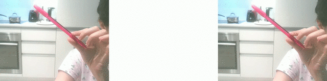

# VirtualPaint-CV
Create virtual painting based on motions captured by the webcam

**How to use:** 
1. Clone the repository
2. Install the requirement packages from requirements.txt
3. Run [color_picker.py](./color_picker.py) to get relevant Hue and Saturation values for the color you want to paint with, by adjusting the values inside the trackbar

4. Add the values from the previous step to *myColors* list inside [paint.py](./paint.py)
5. Extract the corresponding RGB value of the color from [RGB Color Codes Chart](https://www.rapidtables.com/web/color/RGB_Color.html) and add it to *myColorValues* list inside [paint.py](./paint.py)
6. Run [paint.py](./paint.py), and enjoy painting!